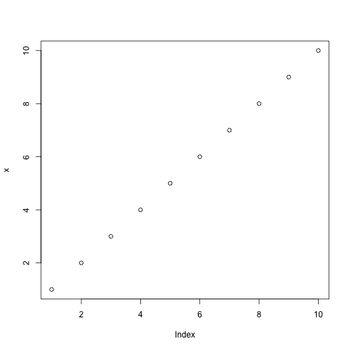

## Read-And-Delete

1. Edit YAML front matter
2. Write using R Markdown
3. Use an empty line followed by three dashes to separate slides!

## Here is another title

- Monday
- Jumble
- Circus

--- .class #id 

## Slide 3

This is on slide 2. Do I use dashes to seperate slides?

Here is a quote:
> I like baked beans,
> except on Tuesday.

Here is code:

     for (x in c(1:10)) {
         a = 1
	 }
	 x = 1:10
	 plot(x)

---

## Slide 4

Here is a plot:
 

---

## Heading test

How many slides?

1. Hello
2. Good-bye

$$s = \sqrt{\frac{{\sum_{i} x_i^2} - n\bar{x}^2}{n-1}}$$

